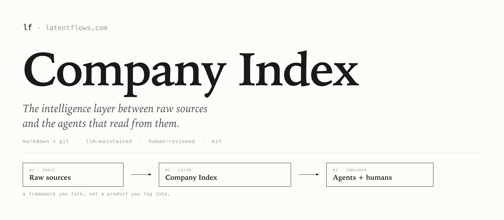
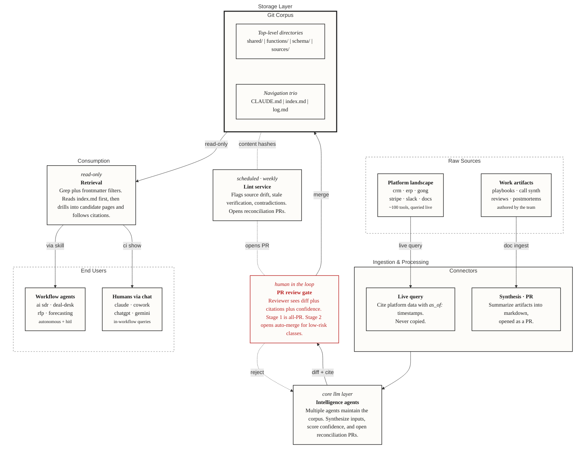
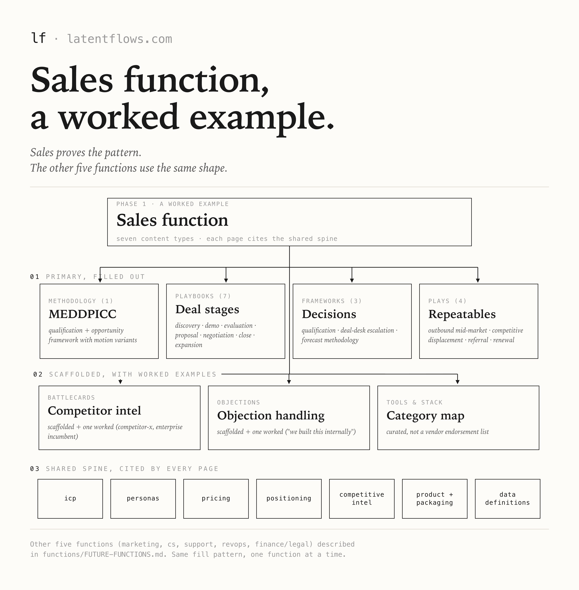
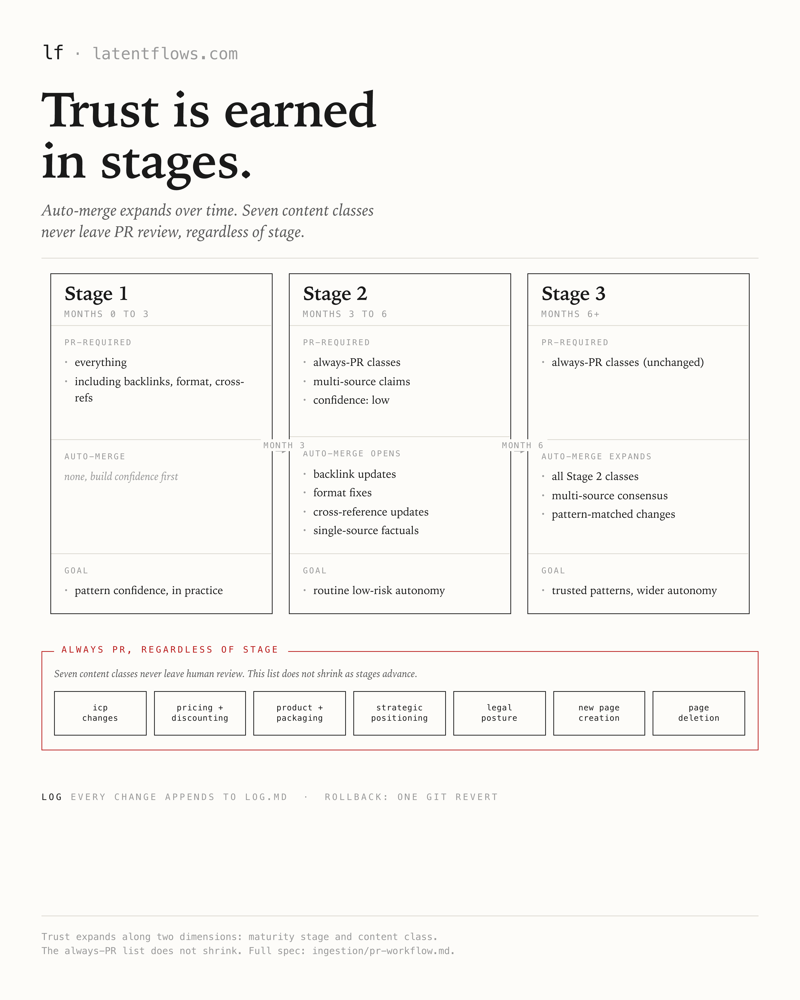

<div align="center">



<br/>

# Company Index

**The intelligence layer your GTM org needs before AI agents can do useful work.**

A markdown-and-git framework for an LLM-maintained, human-reviewed wiki of your ICP, pricing, positioning, plays, and metric definitions. Every claim is cited. Every change is a pull request. Stale content is flagged, not silently rotted.

*A framework you fork, not a product you log into. The filled content is one worked instance: B2B SaaS sales-assisted, $10 to $100M ARR. A different company shape lands on a different spine.*

</div>

---

## The problem

Your team already uses Claude, ChatGPT, Gemini, and Cowork across sales, marketing, and CS. Each tool reads from whatever context someone pastes into the prompt. That context lives in Slack threads, old Notion pages, and people's heads.

Output quality tracks context quality. Yours is scattered across half a dozen surfaces, which is why the agents read inconsistent ICPs, quote last quarter's pricing, and hallucinate positioning.

Wikis tried to fix this and failed. Humans had to update them on top of their real jobs, pages went stale within a quarter, and the team stopped trusting the surface. The wiki became a graveyard.

> [!NOTE]
> **Company Index changes the maintenance economics.** LLMs draft updates from real source material. Humans review and approve via PR. Every page has a `verified_until` date. A weekly lint pass flags drift, contradictions, and expired content, then opens reconciliation PRs. The wiki maintains itself, and your agents finally have a corpus they can trust.

---

## Pick your reading path

> [!TIP]
> The repo is large because the framework is the product. Start in the row that matches you. Each path is 20 to 40 minutes of reading.

<table>
  <thead>
    <tr>
      <th width="22%">If you are</th>
      <th width="28%">Your goal</th>
      <th>Read in this order</th>
    </tr>
  </thead>
  <tbody>
    <tr>
      <td><b>CRO or RevOps leader</b><br/><sub>Deciding whether to invest</sub></td>
      <td>Understand the framework, the rollout, and what makes it hard.</td>
      <td>
        <a href="docs/01-WHY.md"><code>docs/01-WHY.md</code></a>, then
        <a href="docs/03-IMPLEMENTATION.md"><code>docs/03-IMPLEMENTATION.md</code></a> for the rollout plan and the eight hard parts.
      </td>
    </tr>
    <tr>
      <td><b>RevOps lead</b><br/><sub>Self-implementing</sub></td>
      <td>Fork the framework and run it for your org.</td>
      <td>
        <a href="PRINCIPLES.md"><code>PRINCIPLES.md</code></a>, then
        <a href="docs/03-IMPLEMENTATION.md"><code>docs/03-IMPLEMENTATION.md</code></a>, then walk
        <a href="functions/sales/"><code>functions/sales/</code></a> as the worked function.
      </td>
    </tr>
    <tr>
      <td><b>Engineer</b><br/><sub>Auditing the architecture</sub></td>
      <td>Verify the schema, governance, and retrieval model hold up.</td>
      <td>
        <a href="schema/"><code>schema/</code></a>, then
        <a href="ingestion/"><code>ingestion/</code></a>, then
        <a href="PRINCIPLES.md"><code>PRINCIPLES.md</code></a>.
      </td>
    </tr>
  </tbody>
</table>

---

## What is in the box



### Three layers

<table>
  <thead>
    <tr>
      <th width="20%">Layer</th>
      <th>What it holds</th>
      <th>Where</th>
    </tr>
  </thead>
  <tbody>
    <tr>
      <td><b>Raw sources</b></td>
      <td>Call summaries, deal reviews, contract excerpts, internal-doc snapshots. Hybrid in-repo and out-of-repo per a written policy.</td>
      <td><a href="sources/"><code>sources/</code></a></td>
    </tr>
    <tr>
      <td><b>The wiki</b></td>
      <td>Seven shared components every function reads from, plus function-specific content. Motion and segment as frontmatter tags, not parallel directory trees.</td>
      <td><a href="shared/"><code>shared/</code></a>, <a href="functions/"><code>functions/</code></a></td>
    </tr>
    <tr>
      <td><b>The schema</b></td>
      <td>The operating agreement between humans, LLMs, and reviewers. Frontmatter spec, page templates, citation rules.</td>
      <td><a href="schema/"><code>schema/</code></a></td>
    </tr>
  </tbody>
</table>

### Three operations

<table>
  <thead>
    <tr>
      <th width="20%">Operation</th>
      <th>What happens</th>
      <th>Spec</th>
    </tr>
  </thead>
  <tbody>
    <tr>
      <td><b>Ingest</b></td>
      <td>Changes land via PR. Function heads commit in v1. Connectors arrive via the abstract pattern.</td>
      <td><a href="ingestion/pr-workflow.md"><code>ingestion/pr-workflow.md</code></a></td>
    </tr>
    <tr>
      <td><b>Query</b></td>
      <td>Humans and agents retrieve via the <code>ci</code> CLI or native Read and Grep against markdown. Every page cites its sources.</td>
      <td><a href="consumption/"><code>consumption/</code></a></td>
    </tr>
    <tr>
      <td><b>Lint</b></td>
      <td>Weekly pass flags source drift, stale verification, and contradictions. Opens reconciliation PRs. Humans approve.</td>
      <td><a href="ingestion/drift-detection.md"><code>ingestion/drift-detection.md</code></a></td>
    </tr>
  </tbody>
</table>

### The seven shared components

Co-authored content every function reads from. Lives in [`shared/`](shared/).

| Component | What it covers |
|---|---|
| [`icp/`](shared/icp/) | Tiered ICP (A, B, C) with firmographics, triggers, disqualifiers. |
| [`personas/`](shared/personas/) | Individual roles plus buying-committee configurations. |
| [`product-and-packaging/`](shared/product-and-packaging/) | SKUs, editions, add-ons. |
| [`pricing/`](shared/pricing/) | Price book, discount guardrails, usage meters. |
| [`positioning/`](shared/positioning/) | Value props, category narrative, elevator pitches. |
| [`competitive-intel/`](shared/competitive-intel/) | Competitor profiles, win-loss patterns. |
| [`data-definitions/`](shared/data-definitions/) | MQL, SQL, ARR, NRR, CAC, payback. Opinionated and sourced. |

### The navigation trio

The three files that make retrieval deterministic.

<table>
  <thead>
    <tr>
      <th>File</th>
      <th>Role</th>
      <th>Maintained by</th>
    </tr>
  </thead>
  <tbody>
    <tr>
      <td><a href="CLAUDE.md"><code>CLAUDE.md</code></a></td>
      <td>Routing map. Loaded by Claude Code or Cowork at session start.</td>
      <td>Hand-written</td>
    </tr>
    <tr>
      <td><a href="index.md"><code>index.md</code></a></td>
      <td>Catalog of every page with a one-line summary. The agent reads this first.</td>
      <td><code>ci reindex</code></td>
    </tr>
    <tr>
      <td><a href="log.md"><code>log.md</code></a></td>
      <td>Append-only audit trail of every merge, lint pass, and ingest event.</td>
      <td>Automation</td>
    </tr>
  </tbody>
</table>

---

## Worked function

<div align="center">
  
</div>

[`functions/sales/`](functions/sales/) is filled end to end as the proof that the pattern generalizes. Inside you will find:

- **Methodology.** [MEDDPICC](functions/sales/methodology/meddpicc.md) with motion and segment adaptations.
- **Playbooks.** Seven deal-stage playbooks: [discovery](functions/sales/playbooks/discovery.md), [demo](functions/sales/playbooks/demo.md), [evaluation](functions/sales/playbooks/evaluation.md), [proposal](functions/sales/playbooks/proposal.md), [negotiation](functions/sales/playbooks/negotiation.md), [close](functions/sales/playbooks/close.md), [expansion handoff](functions/sales/playbooks/expansion-handoff.md).
- **Frameworks.** [Qualification](functions/sales/frameworks/qualification.md), [deal-desk escalation](functions/sales/frameworks/deal-desk-escalation.md), [forecast methodology](functions/sales/frameworks/forecast-methodology.md).
- **Plays.** [Outbound mid-market](functions/sales/plays/outbound-sequence-mid-market.md), [competitive displacement](functions/sales/plays/competitive-displacement.md), [referral ask](functions/sales/plays/referral-ask.md), [renewal acceleration](functions/sales/plays/renewal-acceleration.md).
- **Battlecards** and **objections.** Scaffolded, with one worked example each.
- **Tools and stack.** Curated category map, not a vendor endorsement list.

The other five functions (marketing, customer success, support, RevOps, finance/legal) are documented as one consolidated page in [`functions/FUTURE-FUNCTIONS.md`](functions/FUTURE-FUNCTIONS.md). It describes what each would cover when filled, plus the fill pattern.

---

## Where this gets hard

> [!IMPORTANT]
> Forking the repo takes a day. Filling it out for your company takes 8 to 12 weeks. The framework points at every hard problem and tells you what we have already thought through. The work that is left is yours.

Eight problems to plan for, documented in [`docs/03-IMPLEMENTATION.md`](docs/03-IMPLEMENTATION.md):

1. Source-system plumbing (HubSpot, Salesforce, Gong, Fathom, Stripe).
2. PII at extraction.
3. Schema design without over-engineering.
4. Cold-start from an existing Confluence or Notion graveyard.
5. Reviewer fatigue at scale.
6. Conflict-resolution UX when two sources disagree.
7. Trust calibration as auto-merge expands.
8. Cost and volume management.

The same doc has the suggested four-phase rollout plan that sequences the work.

---

## Consumption

The `ci` CLI wraps grep, find, and frontmatter filtering. Bash plus `yq`. Zero runtime install. Agents invoke it via the Bash tool.

```bash
ci list --type icp --motion sales-assisted
ci show shared/pricing/price-book
ci search "mid-market discount guardrail"
ci verify --all
ci reindex --check
```

Eleven commands, documented in [`consumption/cli/README.md`](consumption/cli/README.md). The skill definition in [`consumption/SKILL.md`](consumption/SKILL.md) registers `ci` as the canonical retrieval path for Claude Code and Cowork.

---

## Governance



Trust expands along two dimensions.

- **Maturity.** Stage 1 (months 0 to 3) is 100% PR. Stage 2 (months 3 to 6) adds routine auto-merge for low-risk classes. Stage 3 (months 6+) adds multi-source consensus and pattern-matched autonomy.
- **Content type.** Some classes always require a PR regardless of stage: ICP, pricing, packaging, legal, strategic positioning, page creation, page deletion.

Every change appends to [`log.md`](log.md). Rollback is one `git revert` away. Full spec in [`ingestion/pr-workflow.md`](ingestion/pr-workflow.md).

---

## Limitations

This framework is honest about what it does not do.

- **It is a blueprint, not a product.** You fork it, adapt it, and run it. There is no SaaS to log into.
- **It does not ship real connectors.** The abstract pattern is the deliverable. Implementations are yours to build or fork from the community.
- **It does not cover every function on day one.** Sales is filled end to end. The other five are described in [`functions/FUTURE-FUNCTIONS.md`](functions/FUTURE-FUNCTIONS.md) and follow the same fill pattern.
- **It assumes a reviewer pool.** The PR workflow needs humans for the first 90 days. Without that pool, the wiki cannot earn trust to expand auto-merge.
- **It is opinionated about what stays out.** No embeddings, no vector DB, no CMS, no database. The reasoning is in [`PRINCIPLES.md`](PRINCIPLES.md).

---

## Repository structure

```
company-index-framework/
├── README.md                ← you are here
├── PRINCIPLES.md            ← eleven binding principles
├── CLAUDE.md                ← routing map, loaded by agents at session start
├── index.md                 ← catalog of every page (auto-generated)
├── log.md                   ← audit trail (auto-appended)
│
├── shared/                  ← seven co-authored components
├── functions/               ← function-specific content (sales filled, others described in FUTURE-FUNCTIONS.md)
├── sources/                 ← raw sources, hybrid in-repo / out-of-repo policy
│
├── schema/                  ← frontmatter, enums, section-label grammar, page templates
├── ingestion/               ← PR workflow, drift detection, connector pattern
├── consumption/             ← ci CLI and Claude Code skill definition
│
└── docs/                    ← narrative docs: why, architecture, implementation, agents in action
```

---

## Credits

- [Andrej Karpathy's LLM Wiki framework](https://gist.github.com/karpathy/442a6bf555914893e9891c11519de94f) for the navigation trio, index-first retrieval, and append-only log.
- [GitLab Handbook](https://handbook.gitlab.com/docs/frontmatter/) for frontmatter conventions.
- [AGENTS.md](https://agents.md/) for the agent-instruction file standard.
- The RevOps leaders who commented on the original [LinkedIn thread](https://www.linkedin.com/feed/update/urn:li:activity:7450853694281084929/) and pulled this out of my head.

---

## License

MIT. Fork it, ship it, change it.

---

<div align="center">

**Built by [Rasmus Sikk](https://linkedin.com/in/rasmussikk) at [Latentflows](https://latentflows.com).**

<sub>Company Index · 2026</sub>

</div>
